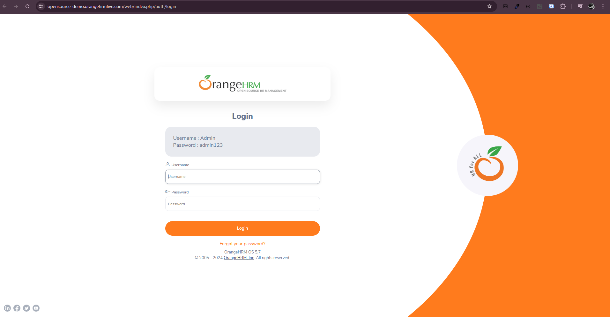

# Automação de Teste com Robot Framework - Site Orange HRM

> Automatizando o site Orange HRM - desenvolvido para ser realizados simulações de testes.
> Possui várias páginas de exemplo para testar diferentes tipos de elementos e funcionalidades, como autenticação, formulários, upload e download de arquivos, listas dinâmicas, etc.

## Para o Teste utilizei:

- SeleniumLibrary
- Robot Framework

[Documentação SeleniumLibrary](https://robotframework.org/SeleniumLibrary/SeleniumLibrary.html#Add%20Cookie)
 
[Documentaçao Robot Framework](https://robotframework.org/#getting-started)

## Extensão VSCODE

- Robot Framework Language Server

## Como rodar o projeto

`robot -d resultados .\register.robot`

## Requisitos:

## Regras de negócio:

- Não se aplica
